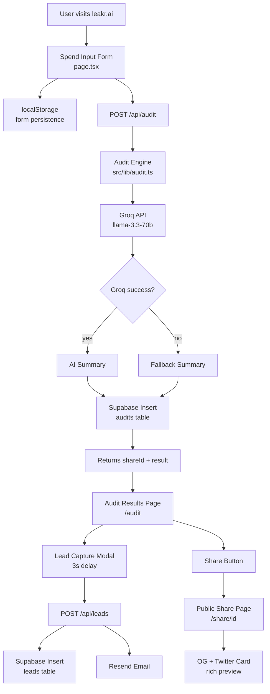

# ARCHITECTURE.md

## System Diagram

---

## Data Flow: How a User's Input Becomes an Audit Result

1. **User fills form** (`src/app/page.tsx`) — selects tools, plans, seats, monthly spend, team size, use case. Form state persists to localStorage on every change.

2. **User submits** — form data is sent via `POST /api/audit` to the Next.js API route (`src/app/api/audit/route.ts`).

3. **Audit engine runs** (`src/lib/audit.ts`) — pure TypeScript functions, no AI. Detects redundancies (overlapping tools), overplans (wrong tier for team size), and right-size opportunities (cheaper plan fits). Returns structured findings with per-tool savings and reasoning.

4. **Groq generates summary** (`src/lib/summary.ts`) — the audit result is passed to Groq's `llama-3.3-70b-versatile` model with a structured prompt. If Groq fails (rate limit, downtime), a templated fallback summary is generated from the audit data directly. No AI dependency for core functionality.

5. **Supabase saves the audit** — the full form input, audit result, AI summary, and savings totals are inserted into the `audits` table. A UUID is returned as the `shareId`.

6. **Results page renders** (`src/app/audit/page.tsx`) — reads form state from localStorage, hits `/api/audit`, displays findings with badges (redundant/overplan/right-size/optimal), hero savings number, AI summary, and Credex CTA for high-savings cases.

7. **Lead modal appears** (3 second delay) — email capture with optional company + role. Honeypot field + in-memory rate limiting (3 req/min/IP) for abuse protection. On submit: saves to `leads` table, sends transactional email via Resend.

8. **Share URL** — `/share/[id]` is a server-rendered page that fetches the audit from Supabase by UUID. Email and company name are stripped. OG and Twitter Card meta tags are generated server-side with savings numbers for rich link previews.

---

## Why I Chose This Stack

**Next.js 14 (App Router) + TypeScript**
Next.js gives us API routes, server-side rendering for the share page (critical for OG tags), and deploys perfectly on Vercel with zero config. TypeScript was chosen because the audit engine has complex type relationships (ToolId, FindingType, AuditResult) that would be error-prone without types. The App Router's server components made the share page's SEO meta tags straightforward.

**Tailwind CSS**
Fastest way to iterate on UI without writing custom CSS. The dark theme with emerald accents required precise color control - Tailwind's utility classes made this manageable. No design system overhead.

**Supabase**
Free tier covers our needs (500MB database, 2GB bandwidth). Provides both the database and the REST API client in one package. UUID primary keys work perfectly for shareable URLs — no sequential IDs that could be enumerated. Row Level Security disabled for MVP (documented tradeoff).

**Groq (llama-3.3-70b-versatile)**
Free tier with generous rate limits. Much faster inference than OpenAI for this use case (~1–2s vs ~4–6s). The audit summary is a simple structured text generation task — a 70B model is more than capable. Fallback to templated summary means the product works even when Groq is down.

**Resend**
Simplest transactional email API available. Free tier sends 100 emails/day which is enough for MVP. One-line React-compatible email templates. The main limitation (free tier only sends to verified domain) is documented as a known tradeoff.

**Vercel**
Zero-config deployment for Next.js. Automatic preview deployments on every push. Free tier covers our traffic. The CI/CD pipeline (GitHub Actions → Vercel) gives us green checks on every commit.

---

## What I'd Change if This Had to Handle 10,000 Audits/Day

**1. Move rate limiting to Redis (Upstash)**
Current in-memory rate limiting resets on every server restart and doesn't work across multiple serverless instances. Upstash Redis would give us persistent, distributed rate limiting.

**2. Add a queue for Groq API calls**
At 10k audits/day (~7 audits/minute), Groq's free tier would hit rate limits. A simple queue (BullMQ or Inngest) would batch requests and handle retries gracefully.

**3. Add database indexes**
Currently the `audits` table has no indexes beyond the primary key. At 10k rows/day, queries on `created_at` and `total_monthly_savings` would need indexes to stay fast.

**4. Cache popular audit patterns**
Many users will enter similar combinations (Cursor Pro + ChatGPT Plus, 5 person team, coding). The audit engine output for identical inputs is deterministic — caching common patterns in Redis would reduce DB writes and Groq calls significantly.

**5. Move to a proper domain + Resend domain verification**
At scale, `onboarding@resend.dev` becomes unprofessional and limits deliverability. A verified `leakr.ai` domain with proper DKIM/SPF records would be required.

**6. Add observability**
At 10k audits/day we need to know when Groq is failing, when Supabase inserts are slow, and which tools are most commonly flagged. Structured logging (Axiom or Datadog) and error tracking (Sentry) would be the first additions.